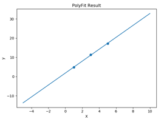

# **Project Report of Machine Learning**

Author: 赵文浩 23020201153860 (计算机科学系)

## I. What is Machine Learning?

- Machine Learning= LAMBDA 

① L=Loss; ② A=Algorithm; ③ M=Model; ④ BD=Big Data; ⑤ A=Application

机器学习由以上五部分组成，主要任务是将数据集Big Data载入到模型Model（可以看作为一个具体的、有输入和确定输出的函数）中；经过模型处理后，对于任意给定的X都有一个确定的预测值Y与之对应；当模型输出的预测值与数据集的真实值差异较小时，对应的模型参数较好，这里使用Loss衡量预测值与真实值之间的差异。为得到最终的模型，需要采用算法Algorithm（如Gradient Descent）对Loss进行调整，从而实现对模型的逐步优化。模型训练完成后，即可应用（Application）到具体的场景下，如人脸识别、价格预测等。

## II. A Simple Design of Machine Learning Engine

本次实验采用Python设计了一个机器学习引擎类PolyFit，其中包含了Section I中提及的五大组成部分，即L+A+M+BD+A。在PolyFit类设计完成后，这里以一阶多项式模型 $y = kx + b$ 为例，并采用如表2-1所示的数据进行参数求解和拟合结果展示，下面将依次介绍各个模块的设计。

<center>表2-1 Data for Curve Fitting</center>

| Independent  Variable | Dependent  Variable |
| :-------------------: | :-----------------: |
|           1           |         4.8         |
|           3           |        11.3         |
|           5           |        17.2         |

### 2.1 Model

考虑到模型的通用性，本次实验设计的多项式模型需要能支持不同阶数的模型，即模型的一般形式为：

 = {w_0} + {w_1}x + {w_2}{x^2} +  \cdots  + {w_M}{x^M} = \sum\limits_{j = 0}^M {{w_j}{x^j}})

因此需要设计的模型参数随样本点的数量而变化。

### 2.2 Loss

损失函数是衡量预测结果与真实结果误差的重要依据，合理设计损失函数是机器学习的重点所在。同样以多项式拟合为例，这里以均方误差作为损失函数，即：$$Loss = {1 \over {2m}}\sum\limits_{i = 1}^m {{{\left( {f\left( {{x_i},w} \right) - {t_i}} \right)}^2}} $$。其中 $$m$$ 为样本点数量， $$f\left( {{x_i},w} \right)$$ 为模型预测值，$${t_i}$$  为样本点对应的真实值，损失函数的具体设计如表2-2所示。

<center>表2-2 Loss Function</center>

```python
	Loss Function
    # 损失函数 @Loss
    # 均方误差
    def loss_function(self):
        mse = 0
        for i in range(0, self.m):
            v = np.polyval(self.w[::-1], self.x[i])
            mse += (self.y[i] - v) ** 2
        return mse / (2 * self.m)
```

### 2.3 Algorithm

为了降低Loss值，这里采用梯度下降（Gradient Descent）对模型参数进行更新，具体实现如表2-3所示。

<center>表2-3 Algorithm</center>

```python
	Gradient Function
    # 计算梯度
    def gradient_function(self):
        diff = np.dot(self.x, self.w) - self.y
        return np.dot(np.transpose(self.x), diff) / self.m
```

 ```python
 	Gradient_Descent
     # 梯度下降 @Algorithm
     def gradient_descent(self):
         gradient = self.gradient_function()
         while not np.all(np.absolute(gradient) <= 1e-5):
             self.w = self.w - self.alpha * gradient
             gradient = self.gradient_function()
 ```

### 2.4 Application

以一阶多项式拟合（线性回归）为例，针对模型  和表2-1所示的数据，得到的目标模型参数为：
$$
\left\{ {\matrix{
   {k = 1.79995331}  \cr 
   {b = 3.10001223}  \cr 

 } } \right.
$$
  即  $$y = 1.79995331x + 3.10001223$$，拟合效果和原始样本点如图2-1所示。



<center> 图 2-1 Poly Fitting Result</center>

示例代码如表2-4所示。

<center>表2-4 Example code</center>

```python
	Example code
    my_fit = PolyFit(1, './data.txt')
    my_fit.gradient_descent()
    plt.scatter(my_fit.x[:, 1], my_fit.y)
    print(my_fit.w)
    func = np.poly1d(np.array([my_fit.w[1, 0], my_fit.w[0, 0]]).astype(float))
    x = np.linspace(-5, 10, 10)
    y = func(x)
    plt.plot(x, y)
    plt.xlabel('X')
    plt.ylabel('y')
    plt.title('PolyFit Result')
    plt.show()
```

## III. Conclusion

本次实验加深了对机器学习的认识，更进一步了解了ML= LAMBDA的具体含义，据此设计了用于多项式拟合的机器学习引擎类，并根据一阶多项式模型和测试数据，采用梯度下降的方式进行验证。但需要指出的是，我对本次实验的详细要求仍不是特别明确，在设计时可能没有完全地将机器学习的各个模块分离耦合，希望在后续的课程学习中继续努力，争取进一步完善课程项目。