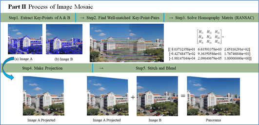
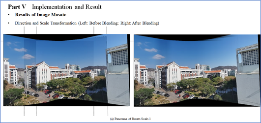
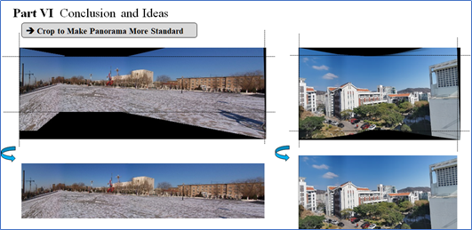

# **Project Report of Machine Learning (Assignment 2)**

Author: 赵文浩 23020201153860 (计算机科学系)

## I. Design A Poster for Dartmouth Conference


> **Poster Details**
>
> 1. Poster的标题为“Poster for Dartmouth Conference on Artificial Intelligence”，主要包含会议时间、会议地点、会议主题、项目发起人、具体讨论话题等内容；
> 2. 同时Poster中提及了Summer Research Project的其他安排，如定期组织学术探讨会（Page 4 of Proposal）以及参会者资金支持（Page 5a of Proposal）等；
> 3. 阅读者可以扫码获取更详细的项目倡议书（Dart564props.pdf）.
> 4. *原图见 Poster for Dartmouth Conference on Artificial Intelligence.png*

## II. Hello, Machine Learning World

- Machine Learning= LAMBDA 

  > ① L=Loss; ② A=Algorithm; ③ M=Model; ④ BD=Big Data; ⑤ A=Application

  以下代码分别展示了LAMBDA各个模块和主函数，如表2-1~表2-5所示。

  *P.S.* *完整代码见与本报告一同提交的工程文件P2-Assignment*

<center>表2-1 Big Data &Model</center>

```python
?	Big Data &Model
    def __init__(self, train_set, test_set, train_label, test_label):
        # =========@BigData=========
        # 导入训练和测试数据
        self.train_set = train_data
        self.test_set = test_data
        self.train_label = train_label
        self.test_label = test_label
        # =========@Model=========
        # 模型参数
        self.weight = np.random.random((3, 5))
```

<center>表2-2 Loss Function</center>

```python
?	Loss Function
    # =========@Loss=========
# 损失函数，计算预测结果与实际标签的距离
def loss_function(self):
        loss = 0
        return loss
```

<center>表2-3 Algorithm</center>

```python
?	Algorithm
    # =========@Algorithm=========
    def update_model_params(self):
        # 更新模型参数
        self.weight += np.random.random((3, 5))
```

<center>表2-4 Application</center>

```python
?	Application
    # =========@Application=========
    # 模型应用，输出预测结果
    def model_test(self, sample):
        random_label = np.random.randint(0, 10)
        return random_label
```

<center>表2-5 Main Function</center>

```python
?	Main Function
if __name__ == '__main__':
    # 加载训练和测试数据
    train_data, test_data, label_train, label_test = load_data()
    # 创建MachineLearning对象
    ml = MachineLearning(train_data, test_data, label_train, label_test)
    # 训练模型（更新模型参数）
    print('--->> start model training...')
    ml.update_model_params()
    print('--->> model training finished, final w= \r\n', ml.weight)
    # 模型评估
    ml.model_evaluate()
    # 随机读取训练集图片，输出识别结果
    test_index = np.random.randint(0, len(label_test))
    label_predict = ml.model_test(sample=test_data[test_index])
    print('--->> {0}; ideal label: {1}; predict label: {2}'.format(label_test[test_index] == label_predict, label_test[test_index], label_predict))
```

## III. Proof Task

### 3.1 Task Description

?	证明：若  $$y =  + 1$$ 或者 $$y =  - 1$$  ，且样本个数相等，均为  $$n$$。则对于中心化后的数据，存在如下结论：

?	①  $${\sum _1} + {\sum _2} \propto {X^T}X$$

?	②  $${\mu _1} - {\mu _2} \propto {X^T}y$$

### 3.2 Proof for Conclusion 1

**Proof 1:** 已知： $${\mu _1} = {1 \over n}\sum\limits_{i = 1}^n {{x_i}} ,{\rm{ }}{\mu _2} = {1 \over n}\sum\limits_{i = n + 1}^{2n} {{x_i}} $$

 $$\therefore \eqalign{
  {\sum _1} =  & {1 \over n}\sum\limits_{i = 1}^n {\left( {{x_i} - {\mu _1}} \right){{\left( {{x_i} - {\mu _1}} \right)}^T}}  \cr 
   =  & {1 \over n}\sum\limits_{i = 1}^n {\left( {{x_i}x_i^T - 2{\mu _1}{x_i} + \mu _1^2} \right)}  \cr 
   =  & {1 \over n}\left( {\sum\limits_{i = 1}^n {{x_i}x_i^T}  - 2{\mu _1}\sum\limits_{i = 1}^n {{x_i}}  + n\mu _1^2} \right) \cr 
   =  & {1 \over n}\left( {\sum\limits_{i = 1}^n {{x_i}x_i^T}  - 2n\mu _1^2 + n\mu _1^2} \right) \cr 
   =  & {1 \over n}\left( {\sum\limits_{i = 1}^n {{x_i}x_i^T}  - n\mu _1^2} \right) \cr 
   =  & {1 \over n}\sum\limits_{i = 1}^n {{x_i}x_i^T}  - \mu _1^2 \cr} $$同理，$${\sum _2} ={1 \over n}\sum\limits_{i = n + 1}^{2n} {{x_i}x_i^T}  - \mu _2^2$$

$$\therefore {\sum _1}{\rm{ + }}{\sum _2} = {1 \over n}\sum\limits_{i = 1}^n {{x_i}x_i^T}  + {1 \over n}\sum\limits_{i = n + 1}^{2n} {{x_i}x_i^T}  - \left( {\mu _1^2 + \mu _2^2} \right) =  {1 \over n}\sum\limits_{i = 1}^{2n} {{x_i}x_i^T}  - \left( {\mu _1^2 + \mu _2^2} \right)$$

 且  $${X^T}X = \sum\limits_{i = 1}^{2n} {{x_i}x_i^T} $$，即： $${\sum _1}{\rm{ + }}{\sum _2} ={1 \over n}{X^T}X - \left( {\mu _1^2 + \mu _2^2} \right)$$

由于 $$n > 0$$ ，且 $${\mu _1},{\rm{ }}{\mu _2}$$ 均为常数，因此 $${\sum _1}{\rm{ + }}{\sum _2} = {1 \over n}{X^T}X - \left( {\mu _1^2 + \mu _2^2} \right) \propto {X^T}X$$

### 3.3 Proof for Conclusion 2

**Proof 2:**

$$\eqalign{
  {X^T}y =  & \sum\limits_{i = 1}^{2n} {{x_i}{y_i}}  \cr 
   =  & \sum\limits_{i = 1}^n {{x_i}{y_i}}  + \sum\limits_{i = n + 1}^{2n} {{x_i}{y_i}}  \cr 
   =  & \sum\limits_{i = 1}^n {{x_i}}  - \sum\limits_{i = n + 1}^{2n} {{x_i}}  \cr} $$ 

且已知：$${\mu _1} = {1 \over n}\sum\limits_{i = 1}^n {{x_i}} ,{\rm{ }}{\mu _2} = {1 \over n}\sum\limits_{i = n + 1}^{2n} {{x_i}} $$，$$\therefore {X^T}y =  \sum\limits_{i = 1}^n {{x_i}}  - \sum\limits_{i = n + 1}^{2n} {{x_i}}  = n\left( {{\mu _1} - {\mu _2}} \right)$$

即：$${\mu _1} - {\mu _2} = {1 \over n}{X^T}y$$，其中 $$n > 0$$，因此 $${\mu _1} - {\mu _2} = {1 \over n}{X^T}y \propto {X^T}y$$

## IV. Comparison of Line Fitting Methods

已知样本 $$\left( {{x_1},{y_1}} \right),\left( {{x_2},{y_2}} \right), \cdots ,\left( {{x_n},{y_n}} \right)$$ ，对于直线拟合问题的求解，主要有最小二乘法、霍夫变换和RANSAC三种解决方案。普通最小二乘法的目标是使得样本总体的误差最小，无法很好地应对噪声，霍夫变换和RANSAC在一定程度上解决了该问题，本节将对以上三种直线拟合算法的具体流程和异同点做简要分析。

### 4.1 Least Square Method

最小二乘法的目标模型为$$y = kx + b$$，损失函数为：$$L\left( {k,b} \right) = \sum\limits_{i = 1}^n {{{\left( {{y_i} - {{\hat y}_i}} \right)}^2}}  =   \sum\limits_{i = 1}^n {{{\left( {{y_i} - \left( {k{x_i} + b} \right)} \right)}^2}} $$  ，最终的模型参数是使得 $$L\left( {k,b} \right)$$ 最小时 $$k,b$$的值。这里可以采用多元函数极值的求法，最终得到目标模型参数为：
$$
\left\{ {\matrix{
   {k = {{\overline {xy}  - \bar x \cdot \bar y} \over {\overline {{x^2}}  - {{\left( {\overline x } \right)}^2}}}} \hfill  \cr 
   {b = \overline y  - k\overline x } \hfill  \cr 

 } } \right.
$$

### 4.2 Hough Transform

霍夫变换经常用于直线、圆、椭圆等边界形状的检测，通过将坐标空间（常采用极坐标系）变换到参数空间，进而实现直线与曲线的拟合。需要说明的是，经过霍夫变换检测的直线会通过绝大部分样本点。

### 4.3 RANSAC (Random Sample Consensus)

不同于最小二乘法以降低总体误差为目标，RANSAC假设观测数据包含局内点和局外点，其中局内点近似地被直线穿过，而局外点远离直线。RANSAC算法的总体流程是采用随机采样的方式拟合数据，使得样本点在容差范围内通过的直线即为最终的拟合结果，这里不对RANSAC的具体算法进行介绍。

### 4.4 Comparison and Application

#### 4.4.1 Comparison

① 操作空间不同

普通最小二乘法和RANSAC算法都在笛卡尔坐标系下操作，霍夫变换需要基于极坐标系变换为参数空间，进而实现直线拟合。

② 对噪声数据的敏感程度不同

三种直线拟合算法中，最小二乘法对于噪声数据敏感性最高，因为最小二乘法从全局误差的角度寻找最优参数。相比之下，Hough Transform和RANSAC能够很好的处理噪声数据。

③ 应用场景不同

最小二乘法常用于直线拟合，对于曲线和其他形状的拟合效果不佳，受选用的误差函数影响较大；Hough Transform 常用于图像中特定形状如直线、圆形的检测；RANSAC常用于直线拟合，通过随机采样的方式找到最佳的拟合结果，由于RANSAC对于噪声数据不敏感，因此常用于图像匹配和图像拼接任务。

#### 4.4.2 RANSAC与图像配准拼接

这里选用上学期Computer Vision某次课程设计为例，说明RANSAC的具体应用场景，如图4-1和4-2所示。



<center>图4-1 Process of Image Mosaic</center>



<center>图 4-2 (a) Results of Image Mosaic</center>



<center>图 4-2 (b) Cropped Results of Image Mosaic</center>

## V. Polynomial Curve Fitting (Paper Task)

### 5.1 Task Description

根据书本“1.1 Example： Polynomial Curve Fitting”的内容，复现实验（可参考https://github.com/ctgk/PRML）；然后，写一篇题为：《基于多项式的曲线拟合方法与分析》的论文。论文至少包含：题目，作者信息，中英文摘要，引言，方法介绍，实验结果与分析，总结与展望，附录（关键代码解析），参考文献。

### 5.2 Polynomial Curve Fitting

见与本报告一同提交的PDF文档——基于多项式的曲线拟合方法与分析。